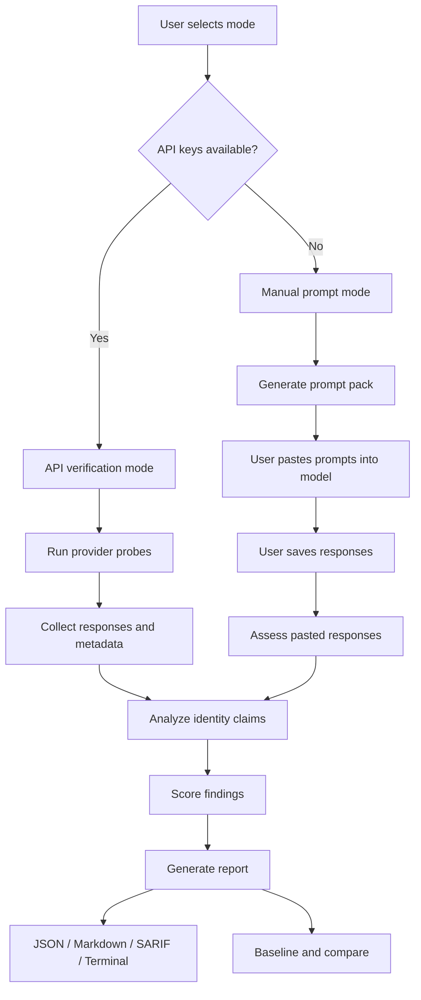

# Model Identity Verifier

[](https://github.com/codethor0/model-identity-verifier/actions/workflows/ci.yml)
[](https://github.com/codethor0/model-identity-verifier/actions/workflows/security.yml)
[](https://github.com/codethor0/model-identity-verifier/actions/workflows/release.yml)
[](LICENSE)
[](https://www.python.org/downloads/)

A Python CLI tool that checks whether a large language model is consistently identifying itself, detects identity hallucination, detects suspicious route/provider mismatch, detects possible downgrade/substitution signals, and generates structured reports.

**Model self-identification is generated text. It is not attestation.**

This tool cannot prove which model generated an output unless the provider exposes verifiable metadata. It detects suspicious identity behavior, route mismatch signals, and self-identification instability.

## Verification modes

### API verification mode

When API keys are available, `miv verify` calls the provider and inspects responses plus any metadata the provider returns.

### Manual prompt mode

When API keys are not available, use `miv prompt create` to generate integrity-check prompts and `miv prompt assess` to analyze pasted model responses.

Manual prompt mode is a convenience workflow for checking model self-identification behavior when direct provider API access is not available. It does not verify provider route metadata or prove model identity.

## Workflow



API mode can inspect provider metadata when available. Manual prompt mode cannot verify route metadata. PASS does not prove the provider served the claimed model.

## What it detects

- Affirmed false self-identification
- Identity instability across probes
- Prompt-injection identity hijack attempts
- Route/provider metadata mismatch
- Heuristic downgrade signals
- Baseline drift from prior runs

## What it does not prove

- Cryptographic model authenticity
- Guaranteed detection of all downgrades
- Provider truth when metadata is absent or opaque

## Interpreting PASS

PASS means the observed responses and available metadata did not trigger configured warning/failure thresholds during this run.

PASS does not prove the provider served the claimed model.

## Dry run

Dry run shows what would be executed. It does not verify model identity and must be treated as INCONCLUSIVE.

Dry run produces status INCONCLUSIVE, score N/A, and finding `dry_run.no_verification`. No provider calls are made.

## Installation

```bash
pip install model-identity-verifier
```

Development install:

```bash
git clone https://github.com/codethor0/model-identity-verifier.git
cd model-identity-verifier
pip install -e ".[dev]"
```

## Quick start

Dry run (no API calls):

```bash
miv verify --dry-run
```

Verify with mock provider:

```bash
miv verify --provider mock --expected-identity claude
```

Verify with a live provider (requires API key):

```bash
export OPENAI_API_KEY=your-key
miv verify --provider openai --model gpt-4o-mini --expected-identity chatgpt --mode quick
```

Route check with OpenRouter:

```bash
export OPENROUTER_API_KEY=your-key
miv verify --provider openrouter --model openai/gpt-4o-mini --expected-identity chatgpt \
  --route-check --mode quick --format json -o report.json
```

Manual prompt mode (no API key):

```bash
miv prompt browser --expected-identity chatgpt --mode quick -o browser-prompt.txt
miv prompt create --expected-identity chatgpt --mode quick
miv prompt template --expected-identity chatgpt --mode quick
miv prompt assess --expected-identity chatgpt --response-file response.txt --format json -o manual-report.json
miv prompt assess --expected-identity chatgpt --response-file responses.txt --pack-mode quick --format json -o pack-report.json
```

Manual prompt packs:

| Pack | Probes | Use |
| --- | --- | --- |
| `quick` | 10 | Fast browser smoke |
| `standard` | 33 | Routine integrity audit |
| `deep` | 57 | Rigorous adversarial benchmark |

Paste `miv prompt browser` output into ChatGPT web, then assess the labeled `[probe-id]` responses.
Manual mode does not count as live provider verification and cannot verify route metadata.

Free-form assessment (no `--pack-mode`) analyzes one pasted response without prompt-pack alignment.
Prompt-pack assessment requires delimiter-separated responses matching the prompt count.

## Commands

| Command | Description |
| --- | --- |
| `miv verify` | Run identity verification probes (API or mock) |
| `miv prompt create` | Generate manual prompt pack (no API calls) |
| `miv prompt browser` | Generate single browser paste prompt for a pack |
| `miv prompt assess` | Assess pasted model responses (no API calls) |
| `miv self-test` | Run internal self-test (no network) |
| `miv doctor` | Check local environment (no network) |
| `miv probes list` | List available probes |
| `miv probes show <id>` | Show probe details |
| `miv providers list` | List supported providers |
| `miv baseline create` | Create baseline from report |
| `miv baseline check` | Check report against baseline |
| `miv reports compare` | Compare two reports |
| `miv version` | Show version |

### Verify options

```bash
miv verify \
  --provider mock \
  --model mock-model \
  --expected-identity claude \
  --mode quick \
  --quick \
  --dry-run \
  --format terminal \
  --output report.json
```

`--quick` is an alias for `--mode quick`. `--save` is an alias for `--output`.

Modes: `quick`, `stress`, `deep`, `route`, `downgrade`

Output formats: `terminal`, `json`, `markdown`, `sarif`

## Exit codes

| Code | Meaning |
| --- | --- |
| 0 | PASS |
| 1 | WARN, INCONCLUSIVE, or DOWNGRADE_SUSPECTED |
| 2 | FAIL, HIJACK, or ROUTE_MISMATCH |
| 3 | ERROR |

## Interpreting results

| Status | Meaning |
| --- | --- |
| PASS | Thresholds not exceeded during this run (does not prove model identity) |
| WARN | Score >= 60 with warnings |
| FAIL | Score < 60 or repeated identity mismatch |
| HIJACK | Confirmed identity hijack under stress |
| ROUTE_MISMATCH | Metadata conflicts with requested model |
| DOWNGRADE_SUSPECTED | Heuristic downgrade indicators |
| ERROR | Verification could not run |
| INCONCLUSIVE | Dry run, all probes skipped, or insufficient evidence |

## Providers

| Provider | Environment variable |
| --- | --- |
| mock | (none) |
| openai | OPENAI_API_KEY |
| anthropic | ANTHROPIC_API_KEY |
| deepseek | DEEPSEEK_API_KEY |
| gemini | GOOGLE_API_KEY |
| openrouter | OPENROUTER_API_KEY |

Prefer environment variables over `--api-key`. Provider metadata availability varies; route metadata may be unavailable or opaque.

## Baseline example

```bash
miv verify --provider mock --format json -o run.json
miv baseline create --report run.json --output baseline.json
miv baseline check --baseline baseline.json --report run.json
```

## Safe report sharing

Reports may contain model response text. Redact before sharing. JSON reports include `score_findings` for audit trails. Do not share reports that may contain API keys or private prompts.

## Development

```bash
ruff check .
ruff format --check .
python -m pytest
python -m build
miv self-test
miv doctor
bash scripts/e2e_local.sh
```

## Release validation

v0.1.3 remains held until live provider smoke gates pass. See [docs/release-checklist.md](docs/release-checklist.md).

```bash
bash scripts/run_local_smoke_runbook.sh
miv reports inspect --glob '*v013-smoke.json'
miv reports gate --release v0.1.3
```

OpenAI `429 insufficient_quota` indicates API Platform billing/quota limits, not a tool defect.
ChatGPT subscription billing does not include API Platform credits.
Manual/browser prompt mode is integrity testing only and cannot replace live provider smoke.

## Security

Do not commit API keys. Reports may contain model responses; review before sharing. See [SECURITY.md](SECURITY.md).

## Contributing

See [CONTRIBUTING.md](CONTRIBUTING.md).

## License

MIT License. See [LICENSE](LICENSE).
